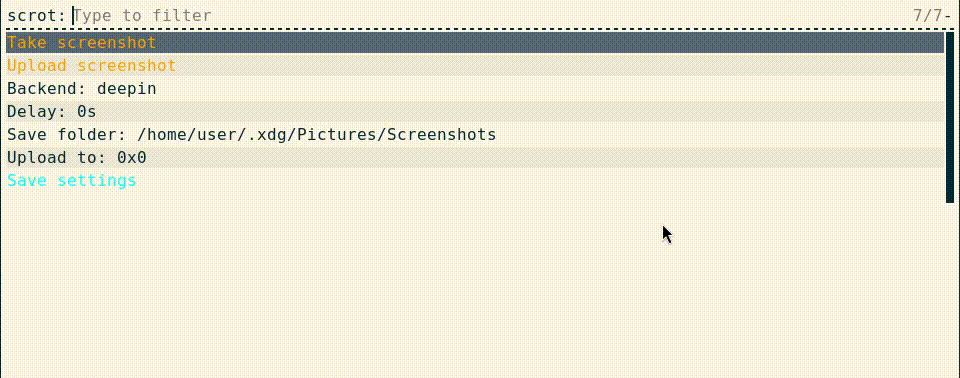
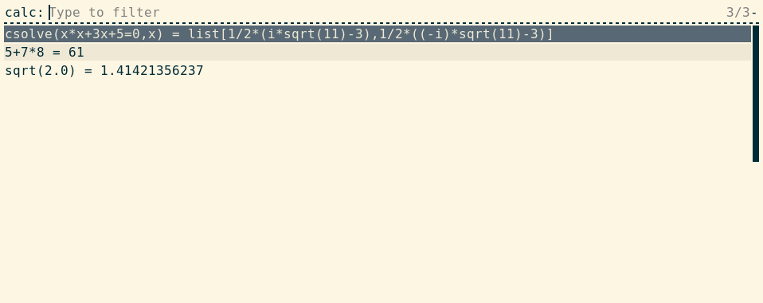

# dotscripts -- My Xorg scripts

# Screenshot

The screenshot script can use the following backends: `deepin-screenshot`
or `maim`. You need to install at least one of them to use the script.

Then set the `BACKEND` variable accordingly in the script's source code.

## Uploading

The screenshot script supports uploading to free image hosting providers.
Currently the following upload sites are supported:
 - [Catbox](https://catbox.moe)
 - [0x0](https://0x0.st)

Imgur used to be supported, but they changed their api and I can't access the site anymore.

## Showcase

 The screenshot script (using the deepin backend)

# Calculator

The calculator requires that you install either:
 - `bc` GNU's bc is a cli calculator
 - `qalc` A python calculator
 - `giac` By the xcas project, a full-featured CAS

Then set the `BACKEND` variable accordingly in the script's source code.

## Showcase

 The calculator script (using the giac backend)

# Installation

To install a script, move it to any path you want and move the required `lib.sh` too.
Then bind any key combination to the script of your liking.

Here's an example i3 config to run the scripts, feel free to modify:
```
# Calculator on `Super+C`:
bindsym $mod+c exec "$SCRIPTPATH/rofi/calculator.sh"

# Screenshot on `PrintScreen`:
bindsym --release Print exec "$SCRIPTPATH/rofi/screenshot.sh"
```

# Using dmenu instead of rofi

All the scripts support using `dmenu` as a lightweight alternative to `rofi`.
To use `dmenu`, change the `GUI_MENU` variable inside of `lib.sh` to `dmenu`:

```
GUI_MENU='dmenu'
```

# License

Everything in this repo is licensed under the MIT license.
